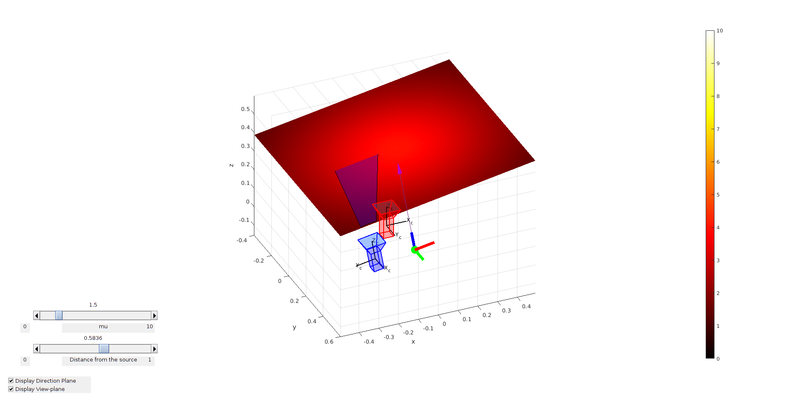

# light_source_modelling
Probabilistic modelling of a near-field non-isotropic light source.

MATLAB Simulator 

# Completed

- Simulator visualisation is working with point source
- Sample the space with a small target
- Obtain the symmetrical sample about the light source position and direction on the view-plane of the line-scan camera
- Estimate light parameters through LS with both points and symmetric points
- Build the light source model using zero-mean GP with SE kernel without symmetric points
- Build the light source model using zero-mean GP with SE kernel with symmetric points
- Build the light source model using constant-mean GP with SE kernel with symmetric points

# To-Do

- Clean up code
- Write mean function for the light source with light source parameters as hyper-parameters which will need to be trained.
- Build the light source model using new mean function GP with SE kernel with/without symmetric points