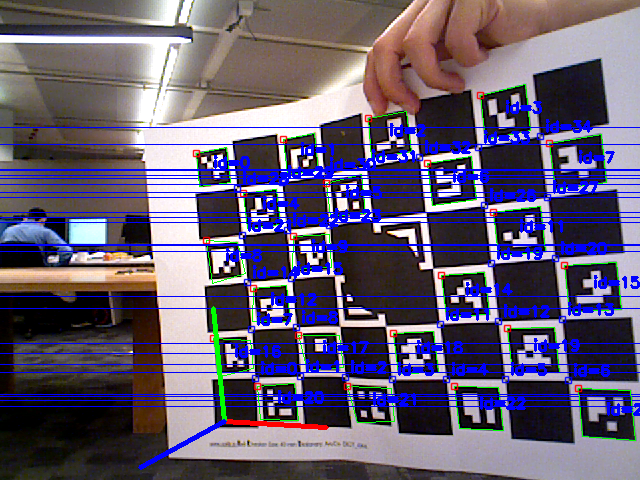
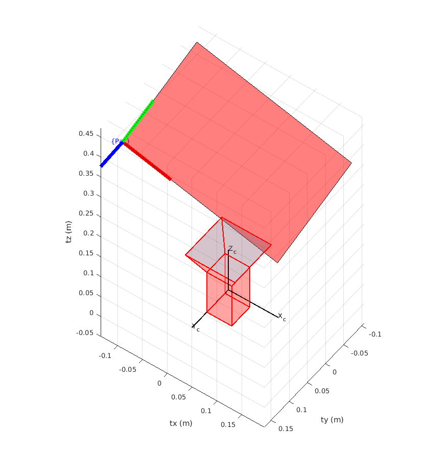
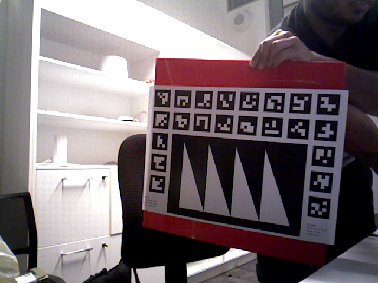
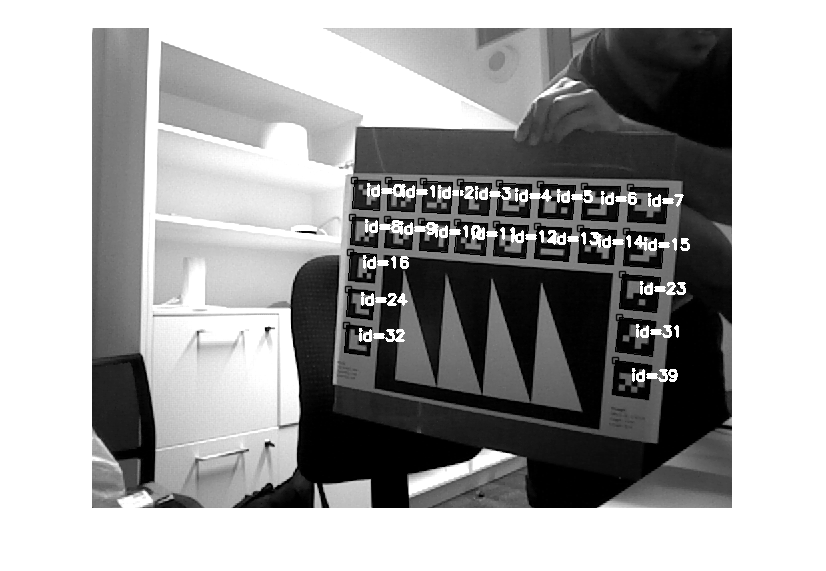
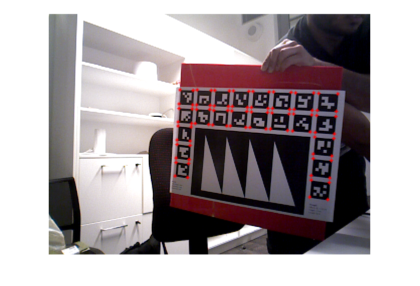
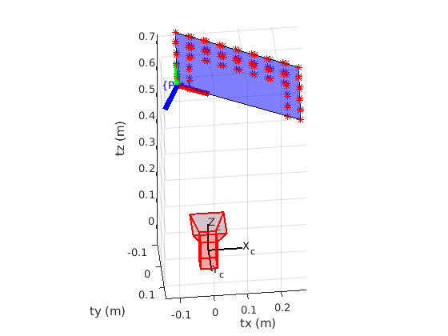

# mex_ChArUco_Pose

**CharucoPosEst.mex**

The MATLAB MEX function for getting the pose of a ChArUco board from the native OpenCV implementation in C++. Link to relevant OpenCV documentation can be found [here](https://docs.opencv.org/4.5.5/df/d4a/tutorial_charuco_detection.html).


**ArucoPixDect.mexa64**

There is also a MATLAB MEX function for getting the identified markers of a ArUco board in pixel coordinates from the native OpenCV implementation in C++. This does NOT estimate the pose of an ArUco board. The pose can be estimated using Perspective-n-Point algorithms such as [IPPE](https://au.mathworks.com/matlabcentral/fileexchange/56571-tobycollins-ippe).

The MEX functions should be located in the `bin` directory with a  `.mexa64` file type (assuming if built on x64 Linux OS). There are included MATLAB test scripts to check if the functions work.

## Requirements

- MATLAB (Tested with 2020b)
- OpenCV 4.0 or higher 

## Building Mex Functions

Create a `build` directory inside current directory.

In a terminal pointing to build run the following:

```bash
cmake ..
make 
```

The built MEX functions can be found in the  `bin`  directory.

## ChArUco Board

Run the MEX function in MATLAB as follows:

```matlab
[rotMat, trans, found, imageOut] = CharucoPosEst(image, intrinsicMatrix, distCoefCV, numOfCols, numOfRows, checkerSideLen, arucoSideLen);
```

| Output   | Description                                                  |
| -------- | ------------------------------------------------------------ |
| rotMat   | Estimated 3x3 rotation matrix of extrinsic pose or pose of the board w.r.t to the camera's coordinate frame. |
| trans    | Estimated 1x3 translation vector of extrinsic pose or pose of the board w.r.t to the camera's coordinate frame. |
| found    | true/false if the pose of the board could be estimated from the image |
| imageOut | Copy of input image with drawn 3D axis, detected markers and their IDs |

Check the test script for further information on how to use the function. Test image of 6x8 ChArUco board with 4x4 ArUco dictionary is shown below. Note that centre of board is covered to highlight advantages of ArUco marker board.


### Detected Pose

Origin is located in the bottom-left corner of the bottom-left marker as shown. Note that the board in test image is not rigid so that is why the axis is off. The extrinsic pose of the camera, the pose of the board in the coordinate frame of the camera, is shown in the right image.

<p float="left">
	
	 
</p><br clear="left">


## ArUco Board

This MEX function identifies the markers that are present in the passed in image and returns their IDs and pixel corner locations to MATLAB. It does NOT estimate the pose of the board, this will need to be done by an Perspective-n-Point algorithm in MATLAB. 

 Run the MEX function in MATLAB as follows:

```matlab
[ids, markerCorner, imageOut] = ArucoPixDect(image);
```

| Output       | Description                                                  |
| ------------ | ------------------------------------------------------------ |
| ids          | Detected marker IDs from image                               |
| markerCorner | The pixel coordinates of the corners for each of the detected marker IDs |
| imageOut     | Copy of input image with drawn detected markers and their IDs |

Check the test script for further information on how to use the function. Test image of a custom 5x8 ArUco board with 4x4 ArUco dictionary is shown below. Note that the missing markers are not included as apart of the setup of the board. 



### Detected Marker and Pose

Origin is located in the bottom-left corner of the bottom-left marker as shown. Note that the board in test image is not rigid so that is why the axis is off. The extrinsic pose of the camera, the pose of the board in the coordinate frame of the camera, is shown in the right image.

<p float="left">
	 
	
</p><br clear="left">


The extrinsic or the pose of the board w.r.t to the camera's coordinate frame is found using the `extrinsics` function built into MATLAB's computer vision toolbox. Note that this function is not robust as it estimates the pose in a linear manner using SVD. Use [IPPE](https://au.mathworks.com/matlabcentral/fileexchange/56571-tobycollins-ippe) instead which estimates the extrinsic through optimisation of reprojection error.



